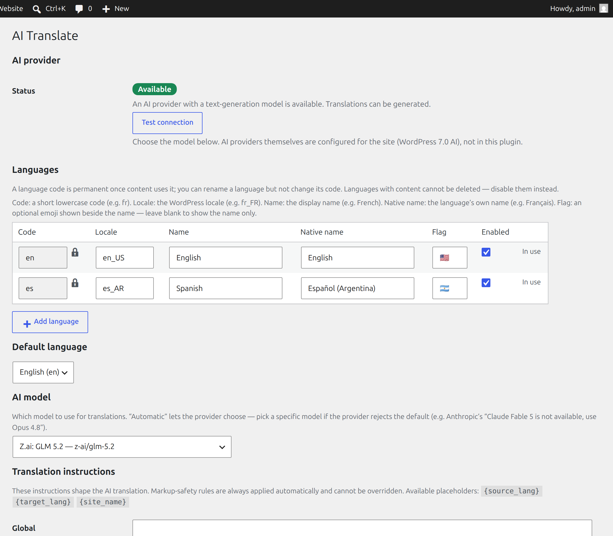
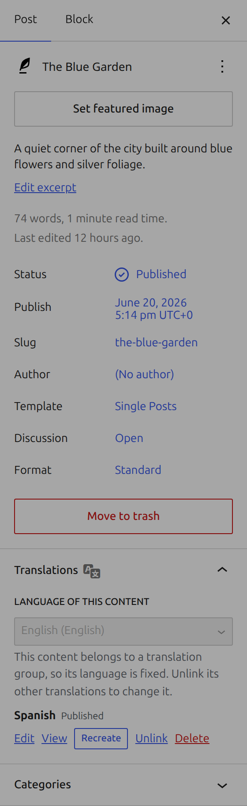
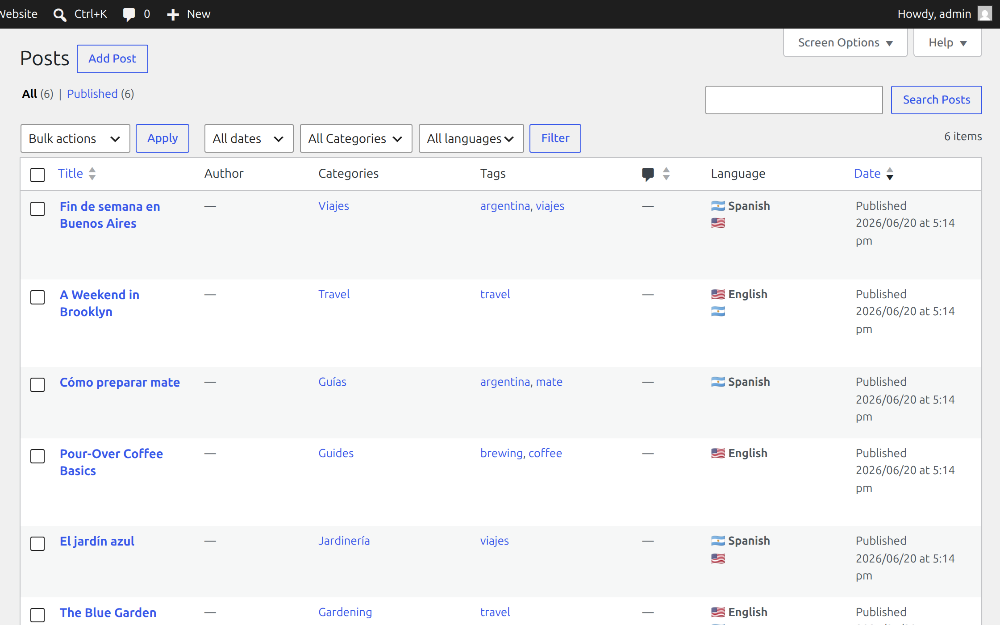
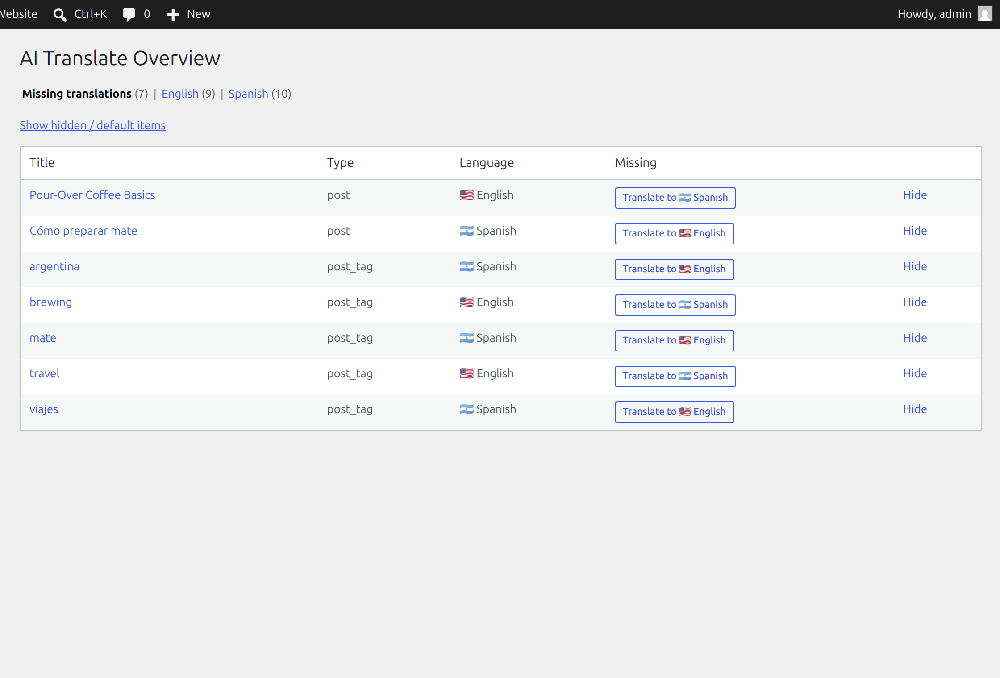

# AI Translate (`wp-ai-translate`)

A deliberately small multilingual plugin for **WordPress 7.0+**. It manages translations of
posts, pages, and the category/tag taxonomies, and generates them on demand using the
WordPress core **AI connectors**.

There are **no custom tables, no rewrite rules, and no locale switching**: each translation is
an ordinary post (or term) with its own permalink, linked to its siblings through a shared
translation group. Translation is always **user-initiated** — nothing runs automatically on
publish.

- Requires: WordPress **7.0+**, PHP **8.1+**, and a configured WordPress AI provider.
- License: GPL-2.0-or-later.

---

## Functionality

### Settings → AI Translate

Configure languages (add/remove with the explicit controls), the default language, the **AI
provider status** with a live *Test connection* check, the **AI model** to use, and the
global / per-content-type / per-language translation instructions.



- **Languages** — each row is a code (permanent once used), locale, name, native name, and an
  optional flag emoji. *Add language* appends a row; *Remove* drops an unused one; languages
  with content are locked ("In use").
- **AI provider** — a green/amber/red status badge reflecting whether a usable
  text-generation model is actually available, plus a *Test connection* button that runs a real
  round trip.
- **AI model** — pick the model to use (typed selection from the provider's advertised models),
  or *Automatic*. Use this if the provider rejects its own default (e.g. Anthropic's "Claude
  Fable 5 is not available, use Opus 4.8").
- **Translation instructions** — global, per-content-type, and per-language fields shape tone
  and style. Non-overridable markup-safety rules are always applied.

### Editor panel & term meta box

Assign the content's language and manage its translations from the block-editor sidebar
(posts/pages) or the term edit screen (categories/tags): **Translate** creates a draft in the
target language, **Recreate** regenerates an existing translation in place (with a confirmation
and a saved revision), plus **View / Edit / Unlink / Delete** and success feedback.



- **Markup-safe output** — block markup, HTML, shortcodes, URLs, and code are preserved; only
  human-readable text is translated. Output is validated (balanced block markup + author-scoped
  `wp_kses`) before anything is written.
- A grouped item's own language is fixed (changing it would orphan a language from the group);
  unlink its siblings first.

### Admin lists & Overview

A **Language column** and **language / Untranslated filters** on the post, page, category, and
tag list tables, plus an **Overview** page that lists missing translations (with per-tab counts
and quick *Translate* actions) and content by language. Default WordPress content (Sample Page,
Privacy Policy, Uncategorized) is excluded, and any item can be hidden.





### Front-end blocks

A **Translation Links** block (links to the current post's translations) and a site-wide
**Language Switcher** block (which also switches the translated archive on category/tag pages).
Both are server-rendered, filtered to publicly-viewable targets, and styled as compact chips.


---

## How to test it

1. **Requirements:** WordPress 7.0+, PHP 8.1+, and a configured WordPress AI provider (e.g. an
   `ai-provider-for-*` plugin with an API key).
2. **Install:** copy `wp-ai-translate/` to `wp-content/plugins/` (or upload a zip of that folder
   via **Plugins → Add New → Upload**), then activate **AI Translate**.
3. **Configure:** under **Settings → AI Translate**, add at least two languages, set the default
   language, confirm the **AI provider** status is green (use *Test connection*), and pick a
   model.
4. **Translate:** open a post, set its language in the **Translations** sidebar panel, click
   **Translate** into another language, then publish the generated draft.
5. **Verify the front end:** add the *Translation Links* or *Language Switcher* block (e.g. in a
   template part) and confirm the links resolve to the sibling translations.

### Automated tests

The repo ships a layered suite (see [`harness/README.md`](harness/README.md)):

```sh
composer install && composer test     # PHP unit (PHPUnit) — tests/php/
npm ci && npm run test:js             # JS unit (Jest) — src/**/*.test.js
./harness/playground.sh test          # both, via the disposable Playground harness
./harness/playground.sh test e2e      # live translation flow against a real AI provider
```

The unit suites are database-free (they mock the AI connector). The E2E layer runs the real
generation flow against a provider configured via a gitignored `harness/.env.local`; it skips
cleanly when no key is present. CI (`.github/workflows/tests.yml`) runs the unit suites on every
PR.

---

## How to develop it

### Repo layout

| Path | What |
|---|---|
| `wp-ai-translate/` | The plugin source (PHP in `includes/`, `blocks/`, built JS in `build/`, `assets/`, `languages/`). |
| `src/` | Block-editor / front-end JS sources, built into `wp-ai-translate/build/` by `@wordpress/scripts`. |
| `harness/` | Disposable WordPress Playground dev/test harness (spin up a real WP 7.0 site, screenshots, screencasts, tests). |
| `tests/php/` | PHPUnit unit suite (+ `phpunit.xml.dist`, `composer.json`). |
| `plan/` | The design spec. |
| `docs/` | README screenshots. |

### Build

```sh
npm install
npm run build           # build all blocks (editor-panel, post-links, language-switcher)
npm run start           # watch the editor panel during development
```

Built bundles under `wp-ai-translate/build/` are committed; CI verifies they're in sync with
`src/`.

### Local environment

The fastest way to a running site is the Playground harness — no Docker or MySQL:

```sh
./harness/up.sh         # bootstrap + serve + activate + seed, prints the URL
```

See [`harness/README.md`](harness/README.md) for the full set of verbs (screenshots,
screencasts, tests, and wiring a real AI provider for E2E).

### Conventions

- Prefixes `wpait_` / `Wpait_` / `_wpait_`; WordPress-Extra docblocks; `defined( 'ABSPATH' ) || exit;`.
- All language/group meta goes through `Wpait_Translation_Store`; all AI connector calls go
  through `Wpait_Translator`.
- Branch off `trunk`; PRs target `trunk`.

### Extending

- `wpait_model_preference` — ordered preferred model IDs (defaults to the configured model).
- `wpait_temperature` — generation temperature (omitted by default).
- `wpait_request_timeout`, `wpait_chunk_threshold`, `wpait_chunk_target`, `wpait_copy_fields`,
  `wpait_overview_skip` — see the inline docblocks.
